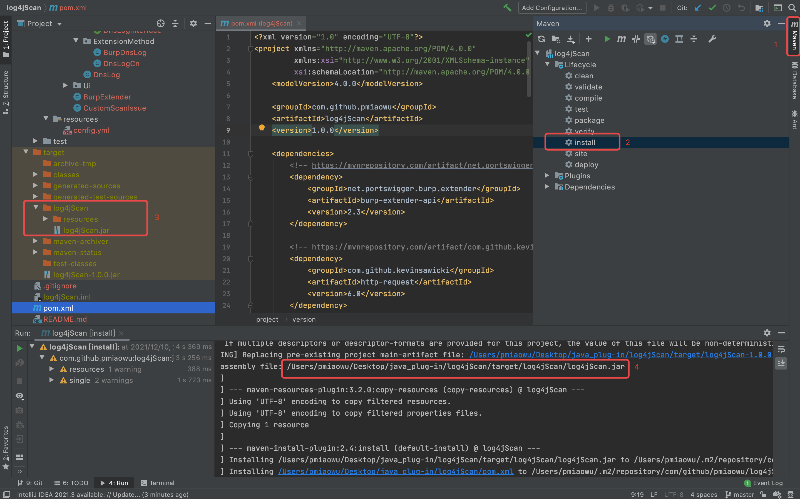
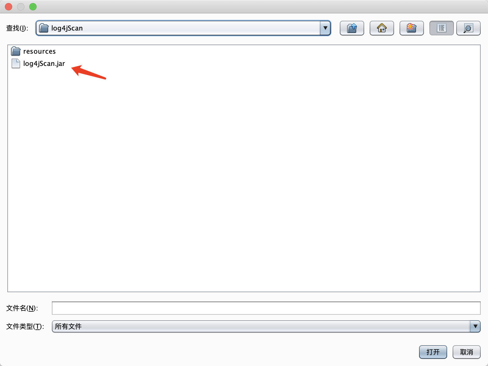
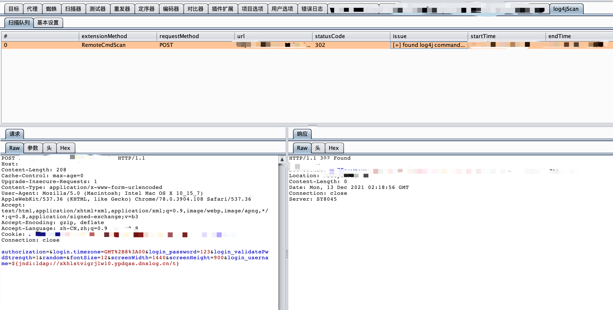
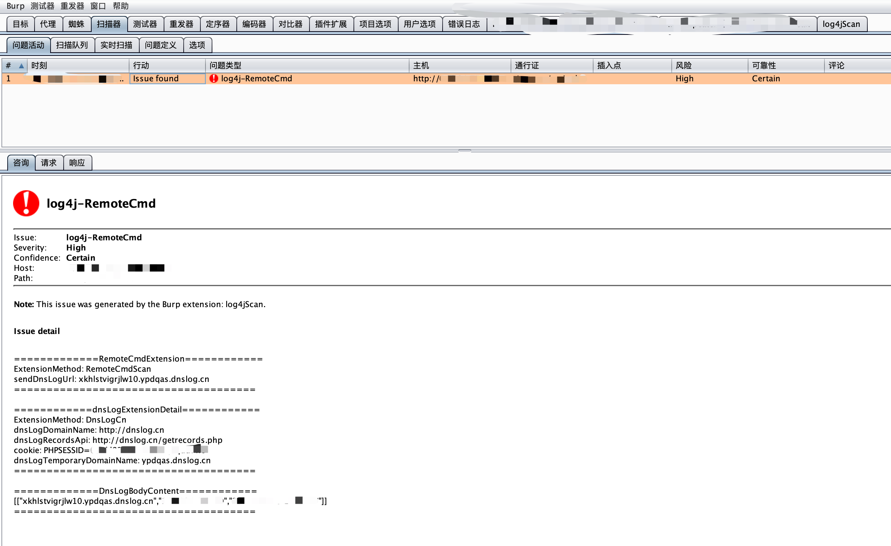
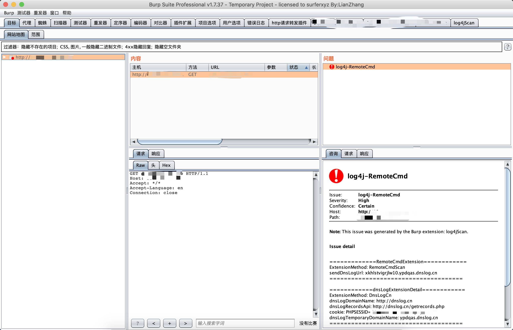
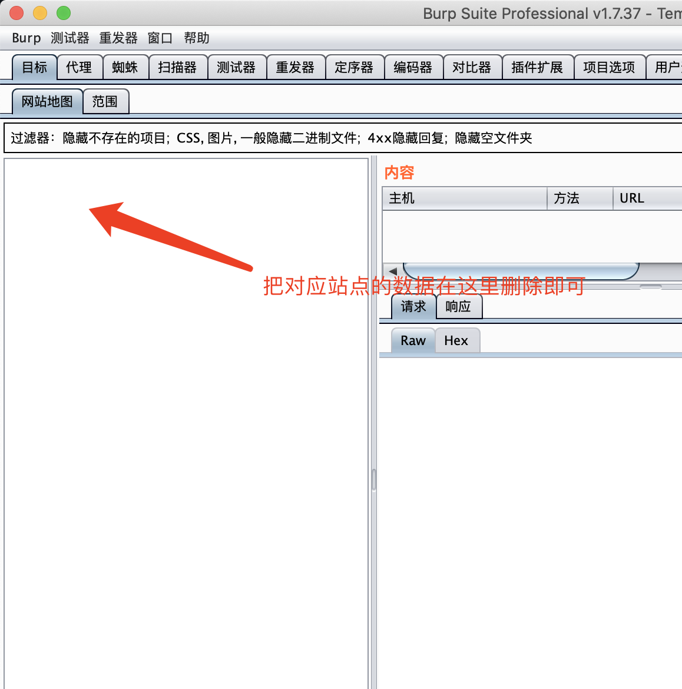
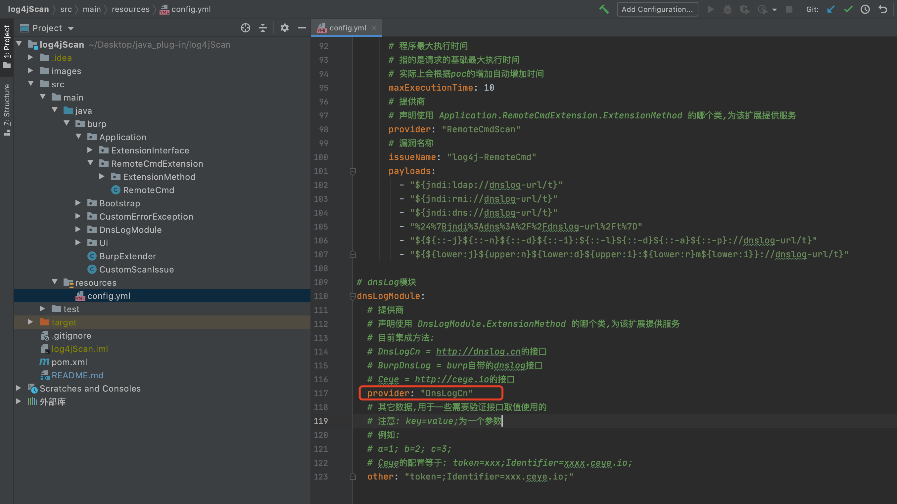
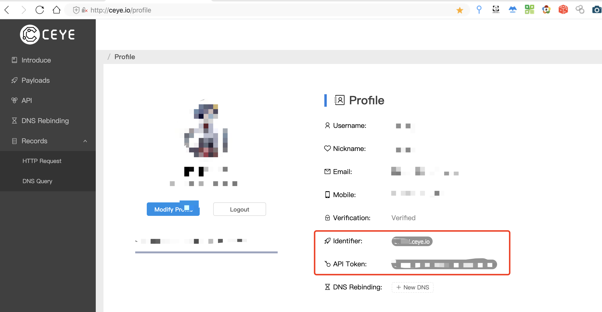
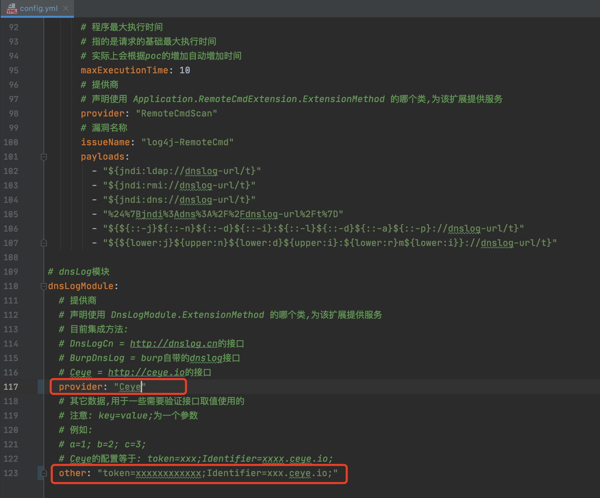

# log4jScan

用于帮助企业内部快速扫描log4j的jndi漏洞的burp插件

# 免责声明

该工具仅用于安全自查检测

由于传播、利用此工具所提供的信息而造成的任何直接或者间接的后果及损失，均由使用者本人负责，作者不为此承担任何责任。

本人拥有对此工具的修改和解释权。未经网络安全部门及相关部门允许，不得善自使用本工具进行任何攻击活动，不得以任何方式将其用于商业目的。

# 简介

log4jScan 一个用于企业内部排查log4j漏洞的插件

该插件会对BurpSuite传进来的请求包进行检测

目前的功能如下
- 远程命令执行

# 请注意!!!!

推荐使用burp2.x的版本,因为在新版burp中,被动扫描会自动成多线程扫描,扫描速度会快很多很多

推荐使用burp2.x的版本,因为在新版burp中,被动扫描会自动成多线程扫描,扫描速度会快很多很多

推荐使用burp2.x的版本,因为在新版burp中,被动扫描会自动成多线程扫描,扫描速度会快很多很多

请自行下载源码,使用与BurpSuite同版本的jdk进行编译,谢谢

请自行下载源码,使用与BurpSuite同版本的jdk进行编译,谢谢

请自行下载源码,使用与BurpSuite同版本的jdk进行编译,谢谢

请自行下载源码,使用与BurpSuite同版本的jdk进行编译,谢谢

请自行下载源码,使用与BurpSuite同版本的jdk进行编译,谢谢

请自行下载源码,使用与BurpSuite同版本的jdk进行编译,谢谢

请自行下载源码,使用与BurpSuite同版本的jdk进行编译,谢谢

请自行下载源码,使用与BurpSuite同版本的jdk进行编译,谢谢

请自行下载源码,使用与BurpSuite同版本的jdk进行编译,谢谢

请自行下载源码,使用与BurpSuite同版本的jdk进行编译,谢谢

# 编译方法

<details>
<summary><b>编译方法</b></summary>

这是一个 java maven项目

导入idea,打开刚刚好下载好的源码


打开: /log4jScan/pom.xml 安装对应的包,第一次安装依赖包需要比较久,慢慢等不要急




编译文件地址: /log4jScan/target/log4jScan/

jar包地址: /log4jScan/target/log4jScan/log4jScan.jar

项目配置文件地址: /log4jScan/target/log4jScan/resources/config.yml

接着拿着这个jar包, 导入BurpSuite即可

</details>

# 安装方法





# 使用方法

我们正常去访问网站, 如果站点的某个请求出现了,那么该插件就会去尝试检测

访问完毕以后, 插件就会自动去进行扫描

如果有结果那么插件就会在以下地方显示
- Tag
- Extender
- Scanner-Issue activity

# 问题查看

目前有这几个地方可以查看







# tag界面查看漏洞情况

```
现在可以通过tag界面查看漏洞情况了

分别会返回
- request parameter no eligible = 请求参数不符合条件(扫描类型设置中控制)
- the number of website problems has exceeded = exceeded 超出网站问题的数量
- the number of website scans exceeded = 超出网站可扫描次数
- waiting for test results = 等待测试结果
- [+] found log4j command execution = 查找到log4j命令执行
- [-] not found log4j command execution = 没有查找到log4j命令执行
- [x] scan task timed out = 扫描任务超时
- [x] unknown error = 未知的错误
```

# 疑难杂症解决

假如扫描出问题了,想要重新扫描怎么办?

例如tag一直出现如下问题:
- the number of website problems has exceeded = exceeded 超出网站问题的数量
- the number of website scans exceeded = 超出网站可扫描次数

解决方案:


# 如何切换dnslog的问题

编译完毕以后,进入log4j文件夹,进入resources目录,打开config.yml

如下:


如果是想换成 DnsLogCn/BurpDnsLog 的话,只需要替换 provider这个值为对应的即可

如果想使用Ceye,那就需要如下操作:



获取token与Identifier

然后打开config.yml,填写成如下样子,如何重新安装插件即可:
